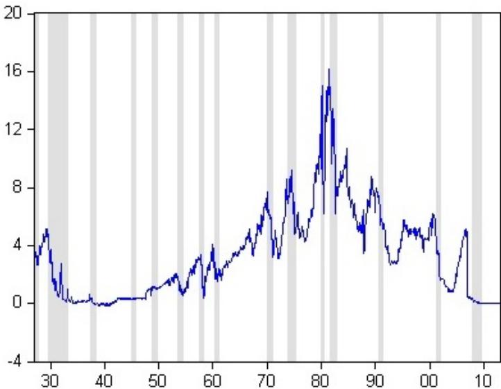
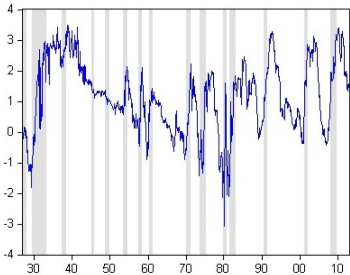
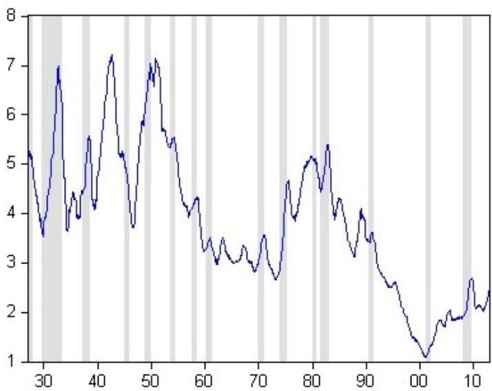
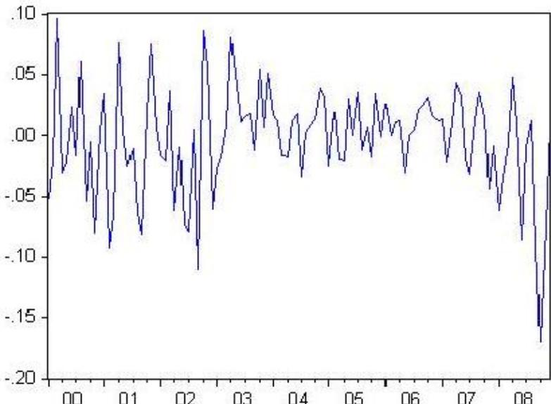

# Predicting the Market Risk Premium

Professor Alexander Barinov

School of Business Administration  
University of California Riverside

MGT 295F Empirical Methods

# Outline

The Source of the Predictability  
2 Treasury Bills and Expected Inflation  
3 EMH Take and Behavioral Take  
Term Spread, Dividend Yield, Default Premium  
5 Return Predictability and Changing Risk  
6 Predictability Caveats

# Expected Risk Premium and Marginal Utility of Consumption

- We normally assume that investors require a high risk premium in bad times, when their consumption is low and their marginal utility of consumption is high  
- In bad times, investors are reluctant to bet their precious consumption and have to be compensated well for doing so  
- In good times, the marginal utility of consumption and the expected risk premium are low  
- Expected market return should be high in recessions and low in expansions

# High Return in Recessions?

- Our historical definition of recessions is backward-looking: recession is the time of bad surprises (selection bias!)  
- NBER definition: recession is the time between the peak and the trough of the business cycle

- Right after the peak, the life could still be good, but it is already recession, because we are heading down  
- Right after the trough, the life is miserable, but the recovery has begun

- When do you get this "high expected return in recessions"? - During early recovery

- After the bloodshed of 1929-1932, the market made  $57.2\%$  in 1933 and  $44.7\%$  in 1935  
The current crisis was followed by the gain of  $31.6\%$  in 2009

# Predictive Regressions

- What is the proxy for expected market risk premium?  
- Rational expectations: next period excess return should be on average right  
- Also, EMH says that if returns are predictable, it must be the expected return (aka risk premium) that is predictable

$$
M K T _ {t} - R F _ {t} = \gamma_ {0} + \gamma_ {1} \Delta G D P _ {t - 1}
$$

- Low GDP growth means low consumption, hence the expected return in the next period has to be high to make us invest - expect  $\gamma_{1}<0$

# Inflation and Business Cycle

- Main story: if expected inflation is high, we are probably in expansion, so risk and expected returns are low  
- Fama and Schwert (JFE 1977) use Treasury bill rate as a proxy for expected inflation

- Assume that real risk-free rate is constant. Then the nominal T-bill rate is the constant plus expected inflation  
- What you will get from T-bill at time t is already known at time t-1, so we get inflation directly from the prices of Treasuries  
- Inflation expectations from T-bills use all information available to the market

# Treasury Bill Yield: FS-77 Updated

# Predictive Regression Updated

$$
M K T _ {t} - R F _ {t} = \begin{array}{c} 1. 3 5 \\ (0. 3 8) \end{array} - \begin{array}{c} 0. 1 6 \\ (0. 0 6 5) \end{array} T B _ {t - 1}
$$

Is the slope statistically significant?  
Expected inflation goes up by  $1\%$ , expected market risk premium goes down by  $0.16\%$  per month - the sign makes sense  
Expected inflation varies by  $3 - 5\%$  peak to trough the difference in risk premium between expansions and recessions is from  $0.16 \cdot 12 \cdot 3\% \approx 6\%$  per year to  $0.16 \cdot 12 \cdot 5\% \approx 10\%$  per year

# Investing in the Market in February 2011: EMH Take

In February 2011, the Treasury bill rate was almost zero  
- Substituting the zero in the predictive regression, we estimate the expected market risk premium in March 2011 at  $1.35\%$  per month,  $16.2\%$  per year  
- EMH says this predictability is all about risk  
- Hence, in March 2011, the market was expected to be almost three times as risky as usual (6% is the historical average risk premium)  
However, with great risk came great reward of  $16\%$  per year return  
- In reality, the market portfolio made only  $0.29\%$  instead of  $1.35\%$  in March 2011

# Investing in the Market in February 2011: Behavioral Take

- Behavioral finance says that markets are inefficient and the predictability of returns is one example  
- Behavioral people will tell you that the market is the market, and  $6 \%$  per year,  $0.5 \%$  per month risk premium is fair enough in February 2011, if it was fair enough before  
- Then  $0.85\% = 1.35\% - 0.5\%$  is your "free lunch" you can expect to get in March 2011  
- You are expected to get  $1.35\%$  in March 2011 whatever you think about EMH, but what you think about EMH will determine how cautious you will be to dig in

# Term Spread and Business Cycle

- Term premium - long-term Treasury bond yield minus short-term Treasury bill yield (say, 10-year minus 1-year)  
- If term premium is high, the market expects interest rates to increase  
- If we view Treasury rates as a proxy for inflation, high term premium means inflation will pick up - more true about recessions  
- If we think the real risk-free rate is also changing, the risk-free rate has to be low in recessions, because the marginal productivity of capital is low in recessions  
- Again, high term premium means the risk-free rate will be higher in the future - more true about recessions

# Term Premium: FF-89 Updated

# Default Premium and Business Cycle

- Default premium - Baa bonds yield minus Aaa bonds yield

- Moody's Aaa rating - very unlikely to default  
- Moody's Baa rating - moderately likely to default

- Evidently, the risk of default is greater in recessions, so default premium is also greater then  
- What should be the sign of the relation between default premium and future market risk premium?

# Default Premium: FF-89 Updated

# Dividend Yield and Business Cycle

- Dividend yield - sum of dividends paid by all firms in the market (usually within the past twelve months) divided by lagged price  
- In recessions, prices are beaten down, but dividends are not (dividends are "sticky")  
- Hence, dividend yield should be high in recessions  
- What should be the sign of the relation between dividend yield and future market risk premium?

# Dividend Yield: FF-89 Updated

# Predicting the Market Risk Premium

$$
\begin{array}{l} M K T _ {t} - R F _ {t} = \begin{array}{l} 0. 1 9 \\ (0. 6 2) \end{array} + \begin{array}{l} 1. 8 3 \\ (0. 6 5) \end{array} D E F _ {t - 1} + \begin{array}{l} 0. 6 9 \\ (0. 2 5) \end{array} D I V _ {t - 1} \\ - \begin{array}{c} 0. 6 1 \\ (0. 1 3) \end{array} T B _ {t - 1} - \begin{array}{c} 0. 4 3 \\ (0. 2 3) \end{array} T E R M _ {t - 1} \\ \end{array}
$$

- Higher DEF and DIV mean higher expected market risk premium - makes sense  
- Lower TB means higher expected market risk premium - makes sense  
- The TERM slope is backwards  
- All coefficients are economically significant

# Predicting Returns for Individual Stocks

- The regressions above can be used to determine company's cost of capital (if EMH is true) and as a market-timing tool (if EMH is false)  
- One can also re-run these regressions at the individual stock level  
- Under EMH, the predictive regressions indicate which way the risk of the LHS variable goes in recessions

# Predicting Returns for Individual Stocks: Example

- Suppose that for stock  $X$  we run regression

$$
R e t _ {t} - R F _ {t} = \gamma_ {0} + \gamma_ {1} \cdot D E F _ {t - 1}
$$

- Suppose that we find that  $\gamma_{1} < 0$  
- Which way does the risk of stock X go in recessions?  
- Would you rather have the risk of your portfolio increase or decrease during recessions?

# Persistent Variables

- Most macroeconomic variables used to predict returns are persistent - once they start increasing, they will keep climbing up for a while and will be slow to come back to the average value  
- Just eyeball the graph - if the variable frequently forms trends, it is persistent  
- Correlation with the variable's own lag (autocorrelation) is a good measure of persistence  
High autocorrelation means high persistence:  $\operatorname{Corr}(TB_{t}, TB_{t-1}) = 0.95$

# TB Yield: Persistent Variable

# Random Walk and White Noise

- Stock prices are the most persistent of all: they are called random walk and have the autocorrelation of 1  
- Once they climb up, they stay there and never revert back to the mean  
- Which implies that stock returns are white noise: they just jump around the average  
- White noise means zero autocorrelation:

$$
\operatorname {C o r r} \left(M K T _ {t}, M K T _ {t - 1}\right) = - 0. 0 0 6
$$

- Random walk means that autocorrelation starts high and declines like a geometric series as the lag increases,  $\text{Corr}(S \& P_t, S \& P_{t-1}) = 0.997$ ,  $\text{Corr}(S \& P_t, S \& P_{t-2}) = 0.994$ ,  $\text{Corr}(S \& P_t, S \& P_{t-12}) = 0.943$

# S&P Index: Random Walk

# S&P Return: White Noise

# Spurious Regression

- When you regress two random walks on each other, the t-stat and R-squared go through the roof, because residuals are random walk too  
- This is spurious regression: even for two unrelated random walks, the t-statistic will be huge  
- Example: regress S&P500 level on GDP - the slope will be significant, but it will mean nothing  
- Or probably it will mean something - if the residuals are not like random walk

# Almost Spurious Regression

- What if you regress white noise on random walk?  
- Residuals will be random walk, and you are in trouble again  
- Regress S&P500 return on GDP - the slope will be significant, but it will mean nothing  
- Advice #1: never put random walks (levels of anything with prices) on the right-hand side in predictive regressions, use changes instead  
- Same applies, but to a smaller extent, if the right-hand side variable is very persistent (like the Treasury bill rate)  
- Advice #1a: take the results from predictive regressions with a grain of salt

# Overlapping Horizons

- Macro variables reflect the long-run state of the economy  
- Why then we use them to predict returns one month ahead?  
- Let's predict returns one year ahead... but we only have 45-80 years  
- Why don't we predict returns 12 months ahead each month?

# Overlapping Horizons

- In October 1991, predict returns from November 1991 to October 1992  
In November 1991, predict returns from December 1991 to November 1992  
- But then, in consecutive months we are predicting almost the same thing - the returns become very persistent  
- Advice #2: do not believe the strong predictability from the regressions with overlapping horizons, especially if it is not accompanied by predictability at the monthly horizon